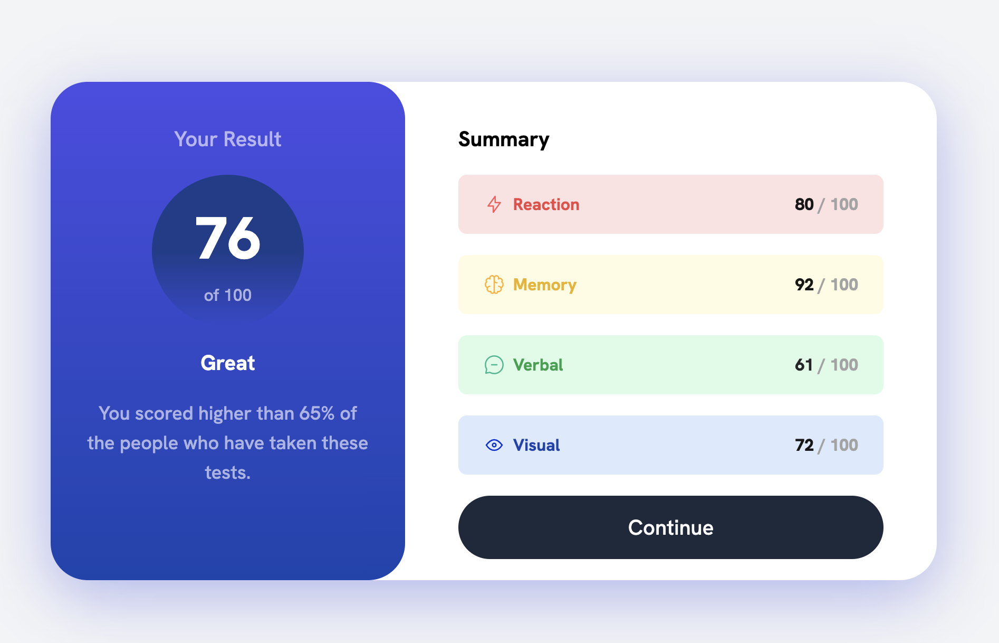

<h2 align="center"> ━━━━━━  ❖  ━━━━━━ </h2>

<!-- BADGES -->

   

   

   

   

    

---

## ❖ Information

I made <a href="https://github.com/jgengo-alt/summary-component">summary-component</a> with TailwindCSS

---

## ❖ Screen

